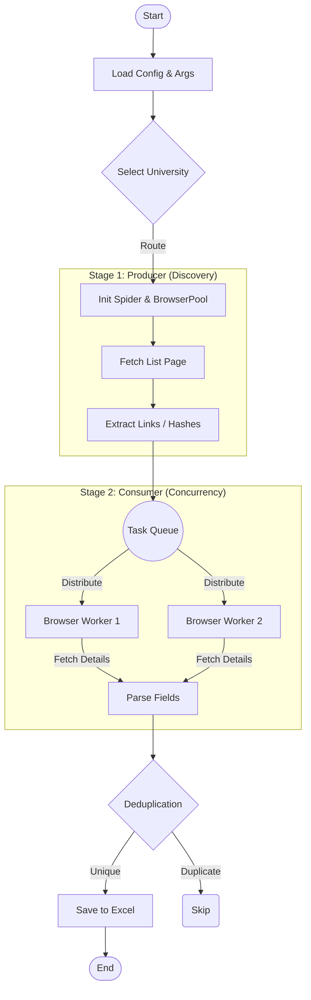

# MySpiderProject (Graduate Program Spider)

> **为留学生申请打造的自动化信息抓取与整理工具**  
> *Automated Graduate Program Information Crawler for Applicants*

我们致力于解决手动收集申请信息的繁琐痛点，通过 **Selenium 浏览器自动化 (Browser Automation)** 技术，一键抓取世界知名大学（如 HKU, CUHK）官网的硕士/博士项目详情（包括截止日期 `Deadline`、申请链接 `Apply URL` 等），并经过**数据管道 (Data Pipeline)** 清洗去重，最终输出为标准化的 **Excel** 申请表。

[]()
[](LICENSE)
[](https://www.python.org/)

[](https://github.com/JACKSKYHADES0910/MySpiderProject/commits/main)
[](https://github.com/JACKSKYHADES0910/MySpiderProject/issues)
[](http://makeapullrequest.com)

---

### 🚀 快速导航 (Quick Links)
[快速开始](#-快速开始-quick-start) | [使用说明](#-使用说明-usage) | [支持学校](#-支持学校矩阵-supported-universities) | [配置](#-配置说明-configuration) | [输出 Schema](#-输出说明--data-schema-output) | [常见问题](#-常见问题-faq--troubleshooting)

---

## 📖 目录 (Table of Contents)

<details>
<summary>👉 点击展开目录 (Click to expand)</summary>

1. [项目技术](#-项目技术-project-technology)
2. [支持学校矩阵](#-支持学校矩阵-supported-universities)
3. [快速开始](#-快速开始-quick-start)
4. [安装](#-安装-installation)
5. [使用说明](#-使用说明-usage)
6. [配置说明](#-配置说明-configuration)
7. [输出说明 & Data Schema](#-输出说明--data-schema-output)
8. [项目结构](#-项目结构-project-structure)
9. [工作原理](#-工作原理-how-it-works)
10. [扩展新学校](#-扩展新学校-add-a-new-spider)
11. [常见问题](#-常见问题-faq--troubleshooting)
12. [适合谁](#-适合谁-who-is-this-for)
13. [合法合规与免责声明](#-合法合规与免责声明-legal--disclaimer)
14. [License](#-license)

</details>

---

## ✨ 项目技术 (Project Technology)

*   **浏览器池并发 (Browser Pool)**: 内置自定义 `BrowserPool`，复用 Selenium WebDriver 实例，支持多线程高并发抓取详细页（需机器性能支持），大幅提升抓取效率。
*   **双模式运行**:
    *   **交互式菜单**: 适合小白用户，按数字选择地区与学校。
    *   **CLI 参数模式**: 支持 `python main.py cuhk --debug`，适合开发者调试或脚本集成。
*   **智能去重 (Deduplication)**: 独立的去重模块，基于“项目名 + URL”生成唯一指纹，防止重复写入 Excel。
*   **深度信息提取**: 能够处理 Hash 路由跳转 (`#tpg`) 和 JS 弹窗详情页，获取隐藏的 `Deadline` 和 `Apply Link`。
*   **稳健的 Data Pipeline**: 从抓取 (Extract) 到 清洗 (Transform) 再到 导出 (Load)，过程异常捕获，确保单条失败不影响整体写入。

---

## 🏫 支持学校矩阵 (Supported Universities)

| 学校 (Region) | 对应爬虫 (Spider Path) | 状态 (Status) | 字段覆盖率 | 备注 (Notes) |
| :--- | :--- | :--- | :--- | :--- |
| **The University of Hong Kong (HKU)** | `spiders/hongkong/hku_spider.py` | ✅ Stable | 100% | 完整支持列表与详情抓取 |
| **The Chinese University of Hong Kong (CUHK)** | `spiders/hongkong/cuhk_spider.py` | ✅ Stable | 95% | 支持 Hash 路由与弹窗解析 |
| **City University of Hong Kong (CityU)** | `spiders/hongkong/cityu_spider.py` | ✅ Stable | 100% | 强制有头模式绕过 Incapsula WAF |
| **The Hong Kong Polytechnic University (PolyU)** | `spiders/hongkong/polyu_spider.py` | ✅ Stable | 100% | 支持博士项目过滤 |
| **Hong Kong Baptist University (HKBU)** | - | 🚧 Planned | - | 计划中 |
| **UK / USA Universities** | - | ⏳ TBD | - | 待开发 |

---

## ⚡ 快速开始 (Quick Start)

**3 分钟跑起来：**

1.  **克隆仓库**
    ```bash
    git clone https://github.com/JACKSKYHADES0910/MySpiderProject.git
    cd MySpiderProject
    ```

2.  **创建并激活虚拟环境**
    ```bash
    # Windows
    python -m venv venv
    .\venv\Scripts\activate
    ```

3.  **安装依赖**
    ```bash
    pip install -r requirements.txt
    ```

4.  **运行**
    ```bash
    python main.py
    ```

---

## 📦 安装 (Installation)

本项目依赖 **Python 3.10+** 和 **Google Chrome**。

### 1. 环境配置
推荐使用虚拟环境以避免依赖冲突。

**Windows PowerShell:**
```powershell
python -m venv venv
.\venv\Scripts\activate
pip install -r requirements.txt
```

**macOS / Linux:**
```bash
python3 -m venv venv
source venv/bin/activate
pip install -r requirements.txt
```

### 2. 浏览器驱动
项目使用 `webdriver-manager` 自动管理驱动，您只需确保本机已安装最新版 Google Chrome 浏览器即可，无需手动下载 ChromeDriver。

---

## 💻 使用说明 (Usage)

### 1. 交互式模式 (Interactive Mode)
最简单的使用方式，程序会引导你操作：
```bash
python main.py
```
*流程：选择地区 (1. Hong Kong) -> 选择学校 (HKU/CUHK) -> 确认运行 -> 自动保存 Excel。*

### 2. 命令行参数模式 (CLI Mode)
适合开发者调试或脚本调用：

*   **无头模式运行 (Headless)**:
    ```bash
    python main.py hku
    ```
*   **调试模式 (Debug)**:
    会弹出浏览器窗口，可观察爬虫点击操作，方便排错：
    ```bash
    python main.py hku --debug
    ```

---

## ⚙️ 配置说明 (Configuration)

核心配置位于 `config.py`，关键参数如下：

| 参数 (Key) | 含义 (Meaning) | 默认值 (Default) | 说明 (Notes) |
| :--- | :--- | :--- | :--- |
| `MAX_WORKERS` | 最大并发线程数 | `24` | 决定详情页抓取速度，过高可能导致内存溢出或被封 IP |
| `TIMEOUT` | 请求超时时间 | `15` (s) | 页面加载或元素查找的最大等待时间 |
| `HEADLESS` | 默认无头模式 | `True` | 默认是否后台静默运行 |
| `OUTPUT_DIR` | 输出目录 | `"output"` | 结果文件保存路径 |
| `UNIVERSITY_INFO` | 学校配置字典 | (Dict) | 包含各学校的入口 URL (`list_url`) 及代码配置 |

---

## 📊 输出说明 & Data Schema (Output)

### 输出文件
爬取结果默认保存在 `output/` 文件夹中。
*   **命名规则**: `{University_Name}_Projects_{Timestamp}.xlsx`
*   **示例**: `HKU_Projects_20231215_120000.xlsx`

### 数据结构 (Data Schema)

| 字段名 (Column) | 含义 (Meaning) | 来源 (Source) | 可空? | 示例数据 (Example) |
| :--- | :--- | :--- | :--- | :--- |
| **学校代码** | 唯一标识 | Config | No | `HK001` |
| **学校名称** | 大学全称 | Config | No | `The University of Hong Kong` |
| **项目名称** | 硕士/博士项目名 | Page Title | No | `Master of Science in Computer Science` |
| **项目官网链接** | 详情页 URL | `href` / Hash | No | `https://hku.hk/tpg/...` |
| **项目申请链接** | 在线申请页 | "Apply Now" 按钮 | Yes | `https://admissions.hku.hk/apply` |
| **项目deadline** | 申请截止日 | 详情页文本 | Yes | `Main Round: 12:00 noon (GMT+8), April 14, 2024` |
| **项目opendate** | 开放申请日 | 详情页文本 | Yes | `September 2023` |
| **学生案例** | 成功案例 | (Reserved) | Yes | (Empty) |
| **面试问题** | 面试真题 | (Reserved) | Yes | (Empty) |

---

## 🏗️ 项目结构 (Project Structure)

```text
MySpiderProject/
├── config.py               # [配置] 全局参数 (并发数, User-Agent, 学校信息)
├── main.py                 # [入口] 程序主入口, 负责 CLI 解析与交互逻辑
├── requirements.txt        # [依赖] 项目依赖库列表
├── spiders/                # [核心] 各大学爬虫逻辑实现
│   ├── base_spider.py      #    -> BaseSpider 基类 (定义接口, 资源管理)
│   ├── hongkong/           #    -> 香港地区
│   │   ├── hku_spider.py   #    -> HKU 具体实现
│   │   └── cuhk_spider.py  #    -> CUHK 具体实现
│   └── ...                 #    -> 扩展其他地区
├── utils/                  # [工具] 通用功能模块
│   ├── browser.py          #    -> Webdriver 初始化与配置
│   ├── selenium_utils.py   #    -> BrowserPool (对象池) & 常用 Selenium 操作封装
│   ├── data_saver.py       #    -> Excel/CSV 保存与预览逻辑
│   ├── deduplicator.py     #    -> 数据去重算法
│   └── progress.py         #    -> 进度条控制
└── output/                 # [产物] 抓取结果存放目录
```

---

## 🛠️ 工作原理 (How it works)

本爬虫采用了经典的 **Producer-Consumer (生产者-消费者)** 模式，结合 **ETL (Extract-Transform-Load)** 架构设计，确保数据抓取的高效性与稳定性。



### 核心流程解析

1.  **🚀 初始化 (Initialization)**: 加载 user-agent 配置，启动 `BrowserPool` 并预热浏览器实例，减少运行时开销。
2.  **📑 列表发现 (Producer)**: 访问学校官网列表页（如 `Programme Listing`），解析出所有项目的 URL 或 Hash ID，推入任务队列。
3.  **⚡ 并发采集 (Consumer)**:
    *   多线程从 `BrowserPool` 中借用浏览器实例。
    *   针对 Hash 路由或弹窗页面，模拟 JS 点击与滚动。
    *   智能等待页面渲染，提取 `Deadline` 和 `Apply Link`。
4.  **✨ 清洗与去重 (ETL)**: 标准化字段格式（移除空白/HTML标签），利用 `URL + Title` 复合键进行去重，确保数据唯一。
5.  **💾 持久化 (Storage)**: 最终数据被结构化写入 `output/` 目录下的 Excel 文件中。

---

## ➕ 扩展新学校 (Add a New Spider)

只需简单的 **3 步** 即可扩展新爬虫：

1.  **配置**: 在 `config.py` 的 `UNIVERSITY_INFO` 中添加学校 Key 和基本 URL。
2.  **实现**: 在 `spiders/` 下新建文件（如 `usa/mit_spider.py`），继承 `BaseSpider` 并实现 `run()` 方法。
3.  **注册**: 在 `main.py` 的 `SPIDER_REGISTRY` 中导入并注册你的类。

```python
# spiders/usa/mit_spider.py 示例
from spiders.base_spider import BaseSpider

class MITSpider(BaseSpider):
    def run(self):
        # 1. 获取列表
        # 2. 并发抓取详情
        # 3. 返回 items 列表
        return self.results
```

---

## ❓ 常见问题 (FAQ / Troubleshooting)

**Q: 报错 `SessionNotCreatedException`?**
A: 本地 Chrome 浏览器版本与 Driver 不兼容。请运行 `pip install --upgrade webdriver-manager` 更新并确保 Chrome 是最新版。

**Q: 有些学校抓取特别慢？**
A: `config.py` 默认并发数 `MAX_WORKERS=24`，如果您的电脑配置较低或网速较慢，请适当降低该值（如 8 或 4）。

**Q: 为什么生成的 Excel 里申请链接是 "N/A"?**
A: 可能是该项目官网结构变更，或者通过简单的静态解析无法获取（如需要登录）。您可以尝试使用 `--debug` 模式观察浏览器行为。

**Q: 出现 `TimeoutException` 或元素找不到？**
A: 网络波动或页面加载过慢。尝试在 `config.py` 中增加 `TIMEOUT` 和 `PAGE_LOAD_WAIT` 的值。

---

## 👥 适合谁 (Who is this for)

*   **留学生 / 申请人**: 告别手动 Excel 整理，一键获取最新的 Program List 和 DDl，高效管理申请时间线。
*   **Python 初学者**: 学习一个结构完整、包含 **并发 (Concurrency)**、**浏览器自动化 (Selenium)** 和 **数据管道** 的真实爬虫项目。

---

<!-- Sections Removed: Roadmap, Contributing, Versioning -->

---

## ⚖️ 合法合规与免责声明 (Legal & Disclaimer)

1.  **学习研究用途**: 本项目仅供 Python 编程学习与个人申请资料整理使用。
2.  **遵守 Robots**: 使用时请自觉遵守目标网站的 `robots.txt` 协议，合理控制请求频率（可调整 `TIMEOUT`），避免对目标服务器造成压力。
3.  **版权声明**: 抓取的数据内容版权归原学校所有，请勿用于商业用途或大规模分发。
4.  **免责**: 开发者不对使用本工具导致的任何法律后果（如 IP 被封禁）负责。

---

## 📄 License

[MIT](LICENSE) © [JACKSKYHADES0910](https://github.com/JACKSKYHADES0910)
