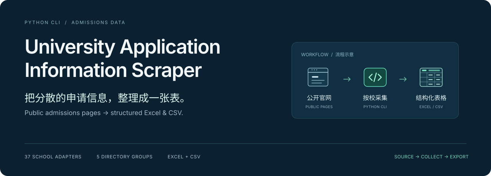

<p align="center">
  
</p>

<h1 align="center">University Application Information Scraper</h1>

<p align="center">
  <strong>大学官网 → 项目信息 → Excel 申请资料表</strong><br />
  Collect graduate program information. Build your application shortlist.
</p>

<p align="center">
  <a href="LICENSE"></a>
  
  <a href="requirements.txt"></a>
  <a href="#universities"></a>
</p>

<p align="center">
  <a href="#quick-start">快速开始</a> ·
  <a href="#output">导出结果</a> ·
  <a href="#universities">学校列表</a> ·
  <a href="#configuration">运行配置</a> ·
  <a href="#contributing">参与改进</a>
</p>

---

选校时，项目名称、申请入口和截止日期往往分散在不同大学的网页里。这个项目把重复的查找与整理工作交给 Python：读取大学公开页面，按学校提取研究生项目信息，再导出为便于筛选、比较和补充的 Excel 表格。

适合正在整理申请清单的同学，也适合学习 Selenium、网页解析和多站点爬虫组织方式的开发者。通过终端菜单或学校代码运行，无需申请 API Key。

> **使用范围：** 仓库包含 37 个已注册的学校适配器；实际可采集的项目、字段和日期取决于学校网页及对应实现。申请信息请回到学校官网复核，尤其是招生年份和截止时间。本工具负责整理信息，不代办或提交申请。

## 可以做什么

| 能力 | 带来的帮助 |
| --- | --- |
| **按学校采集** | 通过地区菜单选择学校，或直接输入 `hku`、`cuhk`、`imperial` 等代码 |
| **处理动态网页** | 使用 Selenium 加载页面；不同适配器按需处理列表、详情页、分页或弹窗 |
| **统一导出字段** | 将学校、项目、学院或学习领域、官网链接、申请入口和日期整理到同一份表格 |
| **预览后保存** | 在终端查看前 10 条结果，再确认是否导出 Excel |
| **按站点扩展** | 复用 `BaseSpider`、浏览器工具、数据保存与去重工具，为新学校添加解析逻辑 |


```mermaid
flowchart LR
  A[选择学校] --> B[读取官网列表]
  B --> C[按站点提取项目信息]
  C --> D[终端预览]
  D --> E[确认导出 Excel]
  E --> F[筛选比较与官网复核]
  style A fill:#edf8f5,stroke:#168b7b,color:#153b35
  style E fill:#edf8f5,stroke:#168b7b,color:#153b35
```

<a id="quick-start"></a>

## 快速开始

建议准备 **Python 3.10 或更新版本**、**Google Chrome** 和 Git，并确保网络可以访问目标学校网站及浏览器驱动下载服务。使用虚拟环境安装依赖。

### 1. 获取项目

```bash
git clone https://github.com/JACKSKYHADES0910/University-Application-Information-Scraper.git
cd University-Application-Information-Scraper
```

### 2. 安装并启动

**Windows PowerShell**

```powershell
python -m venv .venv
.\.venv\Scripts\python.exe -m pip install -r requirements.txt
.\.venv\Scripts\python.exe main.py
```

<details>
<summary><strong>macOS / Linux</strong></summary>

```bash
python3 -m venv .venv
source .venv/bin/activate
python -m pip install -r requirements.txt
python main.py
```

</details>

程序会依次提示：**选择地区 → 输入学校代码 → 确认开始 → 预览结果 → 确认保存**。成功导出的文件位于 `output/`。首次启动浏览器时会尝试自动下载 ChromeDriver，请为驱动下载预留时间。

### 3. 直接指定学校

以下示例使用当前环境的 `python`；Windows 未激活虚拟环境时，请将其替换为 `.\.venv\Scripts\python.exe`。

```bash
# 查看命令帮助
python main.py --help

# 指定香港大学，默认在后台运行浏览器
python main.py hku

# 显示主浏览器窗口，观察香港中文大学页面的采集过程
python main.py cuhk --debug
```

**指定学校代码后仍会询问是否开始及是否保存。** 当前命令行入口适合有人值守的运行；没有免确认或批量执行参数。部分适配器的详情页浏览器池使用独立设置，`--debug` 不一定会显示所有浏览器窗口。

<a id="output"></a>

## 导出结果

默认文件名采用 **`学校代码 学校英文名称.xlsx`**，例如：

```text
output/
└── HK001 The University of Hong Kong.xlsx
```

同一学校再次保存会覆盖同名文件；需要保留不同批次时，请先移动或重命名已有结果。没有采集到数据时不会生成结果文件。保存模块也提供 CSV 导出，并在缺少 Excel 支持库时尝试回退到 CSV。

表格固定包含以下 **10 个字段**，顺序与 [`config.py`](config.py) 中的 `EXCEL_COLUMNS` 一致：

| 字段 | 内容 |
| --- | --- |
| `学校代码` | 配置中的学校标识，例如 `HK001` |
| `学校名称` | 配置中的学校英文名称 |
| `项目名称` | 适配器提取的课程或学位项目名称 |
| `学院/学习领域` | 页面提供的学院、学科或学习领域分类 |
| `项目官网链接` | 用于回溯信息来源的项目详情页 |
| `申请链接` | 项目申请入口；部分学校使用统一申请门户 |
| `项目opendate` | 申请开放日期或相关文本 |
| `项目deadline` | 截止日期、轮次或相关文本 |
| `学生案例` | 预留字段 |
| `面试问题` | 预留字段 |

日期保留各适配器提取的文本，不保证统一为标准日期格式；不同项目也可能存在多轮申请。缺失值可能表现为空白、`N/A` 或适配器给出的提示，不能视为“无截止日期”。

<a id="universities"></a>

## 学校列表

以下数量以 [`main.py`](main.py) 中已注册的适配器为准。**“已注册”表示仓库中包含实现，不代表所有学校当前均已通过在线采集验证。** 站点改版后可能需要调整入口或解析规则。

| 代码分组 | 数量 | 示例学校 |
| --- | ---: | --- |
| 香港 `hongkong/` | 4 | HKU、CUHK、CityU、PolyU |
| 英国 `uk/` | 10 | Imperial、Manchester、Queen's Belfast |
| 美国及昆山杜克 `usa/` | 16 | Stanford、MIT、Harvard、Duke Kunshan |
| 澳大利亚 `australia/` | 3 | ANU、Deakin、UWA |
| 加拿大 `ca/` | 4 | Calgary、Guelph、Manitoba、Montréal |

<details>
<summary><strong>香港 · 4 所</strong></summary>

| 学校 | 命令代码 | 实现 |
| --- | --- | --- |
| The University of Hong Kong | `hku` | [查看](spiders/hongkong/hku_spider.py) |
| The Chinese University of Hong Kong | `cuhk` | [查看](spiders/hongkong/cuhk_spider.py) |
| City University of Hong Kong | `cityu` | [查看](spiders/hongkong/cityu_spider.py) |
| The Hong Kong Polytechnic University | `polyu` | [查看](spiders/hongkong/polyu_spider.py) |

</details>

<details>
<summary><strong>英国 · 10 所</strong></summary>

| 学校 | 命令代码 | 实现 |
| --- | --- | --- |
| Imperial College London | `imperial` | [查看](spiders/uk/imperial_spider.py) |
| University of Manchester | `manchester` | [查看](spiders/uk/manchester_spider.py) |
| University of Aberdeen | `aberdeen` | [查看](spiders/uk/aberdeen_spider.py) |
| Brunel University London | `brunel` | [查看](spiders/uk/brunel_spider.py) |
| Manchester Metropolitan University | `mmu` | [查看](spiders/uk/mmu_spider.py) |
| Queen's University Belfast | `qub` | [查看](spiders/uk/qub_spider.py) |
| Royal Holloway, University of London | `royalholloway` | [查看](spiders/uk/royalholloway_spider.py) |
| University of Strathclyde | `strathclyde` | [查看](spiders/uk/strathclyde_spider.py) |
| University of East Anglia | `uea` | [查看](spiders/uk/uea_spider.py) |
| Ulster University | `ulster` | [查看](spiders/uk/ulster_spider.py) |

</details>

<details>
<summary><strong>美国及昆山杜克 · 16 所</strong></summary>

昆山杜克大学位于中国江苏；这里沿用仓库现有的 `usa/` 目录分组，方便查找实现。

| 学校 | 命令代码 | 实现 |
| --- | --- | --- |
| Stanford University | `stanford` | [查看](spiders/usa/stanford_spider.py) |
| Massachusetts Institute of Technology | `mit` | [查看](spiders/usa/mit_spider.py) |
| Harvard University | `harvard` | [查看](spiders/usa/harvard_spider.py) |
| New York University | `nyu` | [查看](spiders/usa/nyu_spider.py) |
| University of Connecticut | `uconn` | [查看](spiders/usa/uconn_spider.py) |
| Vanderbilt University | `vanderbilt` | [查看](spiders/usa/vanderbilt_spider.py) |
| Emory University | `emory` | [查看](spiders/usa/emory_spider.py) |
| University of Delaware | `delaware` | [查看](spiders/usa/delaware_spider.py) |
| Duke Kunshan University | `duke_kunshan` | [查看](spiders/usa/duke_kunshan_spider.py) |
| Indiana University Bloomington | `indiana_bloomington` | [查看](spiders/usa/indiana_bloomington_spider.py) |
| Iowa State University | `iowa_state` | [查看](spiders/usa/iowa_state_spider.py) |
| University of Kansas | `kansas` | [查看](spiders/usa/kansas_spider.py) |
| University of Maryland | `maryland` | [查看](spiders/usa/maryland_spider.py) |
| Oregon State University | `oregon_state` | [查看](spiders/usa/oregon_state_spider.py) |
| University of California, Santa Cruz | `ucsc` | [查看](spiders/usa/ucsc_spider.py) |
| University of Virginia | `virginia` | [查看](spiders/usa/virginia_spider.py) |

</details>

<details>
<summary><strong>澳大利亚 · 3 所</strong></summary>

| 学校 | 命令代码 | 实现 |
| --- | --- | --- |
| Australian National University | `anu` | [查看](spiders/australia/anu_spider.py) |
| Deakin University | `deakin` | [查看](spiders/australia/deakin_spider.py) |
| University of Western Australia | `uwa` | [查看](spiders/australia/uwa_spider.py) |

</details>

<details>
<summary><strong>加拿大 · 4 所</strong></summary>

| 学校 | 命令代码 | 实现 |
| --- | --- | --- |
| University of Calgary | `calgary` | [查看](spiders/ca/calgary_spider.py) |
| University of Guelph | `guelph` | [查看](spiders/ca/guelph_spider.py) |
| University of Manitoba | `manitoba` | [查看](spiders/ca/manitoba_spider.py) |
| Université de Montréal | `montreal` | [查看](spiders/ca/montreal_spider.py) |

</details>

<a id="configuration"></a>

## 运行配置

通用配置位于 [`config.py`](config.py)。部分适配器有自己的等待、重试或并发设置，调整前请同时查看对应学校的实现。

| 配置 | 仓库默认值 | 用途 |
| --- | --- | --- |
| `MAX_WORKERS` | `24` | 引用此配置的适配器使用的并发数；首次运行可按机器资源调低 |
| `TIMEOUT` | `15` 秒 | 通用等待超时配置 |
| `PAGE_LOAD_WAIT` | `20` 秒 | 通用页面加载等待配置 |
| `MAX_RETRIES` | `3` | 通用重试配置 |
| `OUTPUT_DIR` | `"output"` | 默认结果保存目录 |
| `UNIVERSITY_INFO` | 学校配置字典 | 学校代码、名称、入口地址与域名等信息 |

主浏览器默认以无头模式运行，使用 `--debug` 显示窗口。并发数越高，浏览器资源占用通常越大；降低并发可减少同时发起的访问，`TIMEOUT` 是等待上限，并非请求间隔。

## 项目结构

```text
University-Application-Information-Scraper/
├── main.py                 # 交互菜单、命令行参数与学校注册表
├── config.py               # 学校入口、通用配置与导出字段
├── requirements.txt        # Python 依赖
├── spiders/
│   ├── base_spider.py       # 适配器基类与资源管理
│   ├── hongkong/            # 香港学校适配器
│   ├── uk/                 # 英国学校适配器
│   ├── usa/                # 美国学校与昆山杜克适配器
│   ├── australia/          # 澳大利亚学校适配器
│   └── ca/                 # 加拿大学校适配器
├── utils/
│   ├── browser.py          # Chrome 驱动初始化
│   ├── selenium_utils.py   # 浏览器池与常用操作
│   ├── data_saver.py       # 表格预览、Excel / CSV 保存
│   ├── deduplicator.py     # 去重工具
│   ├── deep_crawler.py     # 深度页面采集辅助
│   └── progress.py         # 进度显示
└── output/                 # 运行后生成的结果，不纳入版本管理
```

具体采集流程由各学校适配器实现。浏览器池、并发和去重工具按需使用，并非所有学校共享完全相同的处理流程。

## 常见问题

<details>
<summary><strong>浏览器没有启动，或提示 SessionNotCreatedException</strong></summary>

确认已安装 Chrome，并检查浏览器与驱动版本是否匹配。首次运行需要访问驱动下载服务；下载失败时先检查网络。项目会先尝试 `webdriver-manager`，失败后再尝试 Selenium Manager。使用 `--debug` 可观察主浏览器是否成功启动。

</details>

<details>
<summary><strong>运行较慢、内存占用高，或出现 TimeoutException</strong></summary>

先单独运行一所学校，并打开 `--debug` 观察页面。对使用全局并发配置的适配器，可调低 `MAX_WORKERS`；对加载较慢的页面，检查实际使用的等待配置。网站入口或结构发生变化时，单纯增加超时不能修复解析规则。

</details>

<details>
<summary><strong>日期或申请链接为空，或者没有采集到项目</strong></summary>

先打开目标学校官网，确认相关信息是否公开、入口是否变化，再检查对应适配器。不同页面的公开信息并不一致；空值不代表项目不招生。提交问题时请附学校代码、页面链接、运行命令和去除个人信息后的报错。

</details>

<details>
<summary><strong>没有找到导出文件，或保存失败</strong></summary>

确认程序已采集到数据，且在“是否保存到 Excel”提示时没有选择 `n`。默认从仓库根目录运行时，结果位于 `output/`。如果同名文件正在被 Excel 打开，请关闭后再保存；保留旧批次前请先备份同名文件。

</details>

<a id="contributing"></a>

## 参与改进

欢迎通过 [Issues](https://github.com/JACKSKYHADES0910/University-Application-Information-Scraper/issues) 反馈站点改版、缺失字段或文档问题，也欢迎提交 Pull Request。可复现的问题描述应包含学校代码、目标页面、运行命令、Python / Chrome 版本，以及预期结果和实际结果。

添加新学校时：

1. 在 `config.py` 的 `UNIVERSITY_INFO` 中添加学校信息和公开页面入口。
2. 在对应 `spiders/` 目录中继承 `BaseSpider`，提供接收 `headless` 的构造函数，将学校配置键（如 `hku`）传给基类，并实现 `run()`，返回符合导出字段的数据列表。
3. 在 `main.py` 中导入并加入 `SPIDER_REGISTRY`，同时将学校代码加入 `print_region_universities()` 对应的地区列表；新增地区时还需更新 `REGION_INFO`。
4. 验证页面解析、缺失字段处理和导出结果，并更新本页学校列表。请说明实际验证的学校与页面范围。

## 使用约定与许可

访问学校网站时，请遵守其访问规则、`robots.txt` 和使用条款，合理控制频率。采集结果仅用于信息整理，学校官网始终是申请要求与时间安排的最终依据。

项目代码采用 [MIT License](LICENSE)。学校网页及其内容的权利归原权利人所有，代码许可不等于对第三方内容的授权。
