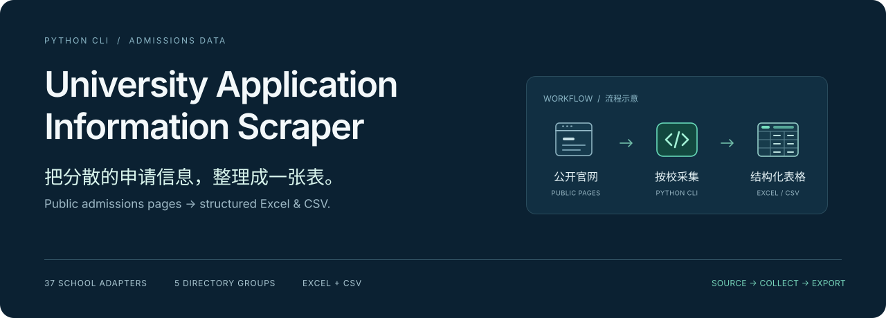
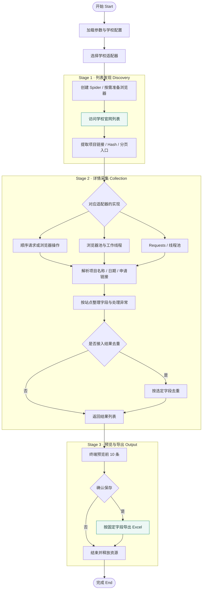

<p align="center">
  
</p>

<h1 align="center">University Application Information Scraper</h1>

<p align="center">
  <strong>大学官网 → 项目信息 → Excel 申请资料表</strong><br />
  <em>Automated Graduate Program Information Crawler for Applicants</em><br />
  Collect graduate program information. Build your application shortlist.
</p>

<p align="center">
  <a href="LICENSE"></a>
  
  <a href="requirements.txt"></a>
  <a href="#universities"></a>
</p>

<p align="center">
  <a href="https://github.com/JACKSKYHADES0910/University-Application-Information-Scraper/commits/main"></a>
  <a href="https://github.com/JACKSKYHADES0910/University-Application-Information-Scraper/issues"></a>
  <a href="#contributing"></a>
  <a href="https://github.com/JACKSKYHADES0910/University-Application-Information-Scraper/stargazers"></a>
</p>

<p align="center">
  <a href="#quick-start">快速开始</a> ·
  <a href="#output">导出结果</a> ·
  <a href="#universities">学校列表</a> ·
  <a href="#configuration">运行配置</a> ·
  <a href="#contributing">参与改进</a>
</p>

---

**为留学生申请打造的自动化信息抓取与整理工具。**

选校时，项目名称、申请入口和截止日期往往分散在不同大学的网页里。这个项目把重复的查找与整理工作交给 Python：读取大学公开页面，按学校提取研究生项目信息，再导出为便于筛选、比较和补充的 Excel 表格。

适合正在整理申请清单的同学，也适合学习 Selenium、网页解析和多站点爬虫组织方式的开发者。通过终端菜单或学校代码运行，无需申请 API Key。

> **使用范围：** 仓库包含 37 个已注册的学校适配器；实际可采集的项目、字段和日期取决于学校网页及对应实现。申请信息请回到学校官网复核，尤其是招生年份和截止时间。本工具负责整理信息，不代办或提交申请。

<a id="contents"></a>

## 📖 目录 (Table of Contents)

<details>
<summary><strong>展开完整目录：从第一次运行，到理解代码与扩展学校</strong></summary>

1. [项目概览与核心能力](#overview)
2. [快速开始](#quick-start)
3. [安装与环境配置](#installation)
4. [使用说明](#usage)
5. [输出说明与 Data Schema](#output)
6. [支持学校矩阵](#universities)
7. [项目技术](#technology)
8. [配置说明](#configuration)
9. [项目结构](#structure)
10. [工作原理与核心流程](#how-it-works)
11. [扩展新学校](#extend)
12. [常见问题](#faq)
13. [适合谁](#audience)
14. [参与改进](#contributing)
15. [合法合规与免责声明](#responsible-use)
16. [License](#license)

</details>

**阅读路线：** 想先运行，直接从快速开始进入；想了解采集结果，查看输出字段与学校矩阵；想学习或修改爬虫，继续阅读项目技术、工作原理和扩展指南。

<a id="overview"></a>

## 🎯 项目概览 (Overview)

从官网列表发现项目，从详情页面提取信息，再把结果整理成可以继续使用的表格。项目围绕这条流程组织学校适配器与通用工具。

### 能力概览

| 能力 | 带来的帮助 |
| --- | --- |
| **按学校采集** | 通过地区菜单选择学校，或直接输入 `hku`、`cuhk`、`imperial` 等代码 |
| **处理动态网页** | 使用 Selenium 加载页面；不同适配器按需处理列表、详情页、分页或弹窗 |
| **统一导出字段** | 将学校、项目、学院或学习领域、官网链接、申请入口和日期整理到同一份表格 |
| **预览后保存** | 在终端查看前 10 条结果，再确认是否导出 Excel |
| **按站点扩展** | 复用 `BaseSpider`、浏览器工具、数据保存与去重工具，为新学校添加解析逻辑 |


```mermaid
flowchart LR
  A[选择学校] --> B[读取官网列表]
  B --> C[按站点提取项目信息]
  C --> D[终端预览]
  D --> E[确认导出 Excel]
  E --> F[筛选比较与官网复核]
  style A fill:#edf8f5,stroke:#168b7b,color:#153b35
  style E fill:#edf8f5,stroke:#168b7b,color:#153b35
```

<a id="quick-start"></a>

## ⚡ 快速开始 (Quick Start)

建议准备 **Python 3.10 或更新版本**、**Google Chrome** 和 Git，并确保网络可以访问目标学校网站及浏览器驱动下载服务。使用虚拟环境安装依赖。

### 1. 获取项目

```bash
git clone https://github.com/JACKSKYHADES0910/University-Application-Information-Scraper.git
cd University-Application-Information-Scraper
```

### 2. 安装并启动

**Windows PowerShell**

```powershell
python -m venv .venv
.\.venv\Scripts\python.exe -m pip install -r requirements.txt
.\.venv\Scripts\python.exe main.py
```

<details>
<summary><strong>macOS / Linux</strong></summary>

```bash
python3 -m venv .venv
source .venv/bin/activate
python -m pip install -r requirements.txt
python main.py
```

</details>

程序会依次提示：**选择地区 → 输入学校代码 → 确认开始 → 预览结果 → 确认保存**。成功导出的文件位于 `output/`。首次启动浏览器时会尝试自动下载 ChromeDriver，请为驱动下载预留时间。

<a id="installation"></a>

## 📦 安装与环境配置 (Installation)

### 1. 运行前准备

| 环境 | 用途与说明 |
| --- | --- |
| Python | 建议使用 Python 3.10+；仓库未提供完整的版本兼容测试矩阵 |
| Google Chrome | Selenium 采集器使用的浏览器，需要预先安装 |
| Git | 下载仓库及获取后续更新 |
| 网络连接 | 访问学校公开页面，并在需要时下载 ChromeDriver |
| 本地写入权限 | 安装虚拟环境依赖、保存 `output/` 下的结果 |

### 2. 创建并激活虚拟环境

快速开始使用虚拟环境解释器的完整路径，Windows 下无需激活也能运行。日常开发时也可以激活环境，后续直接使用 `python` 和 `python -m pip`。

**Windows PowerShell：**

```powershell
python -m venv .venv
.\.venv\Scripts\Activate.ps1
python -m pip install -r requirements.txt
```

如果当前 PowerShell 不允许运行激活脚本，可使用快速开始中的 `.\.venv\Scripts\python.exe`，不必为了运行项目修改执行策略。

**macOS / Linux：**

```bash
python3 -m venv .venv
source .venv/bin/activate
python -m pip install -r requirements.txt
```

依赖列表见 [`requirements.txt`](requirements.txt)。其中 `openpyxl` 提供 Excel 写入支持，`rich` 用于终端表格与链接展示。推荐安装完整依赖后再运行主程序。

### 3. 浏览器驱动

项目首先使用 `webdriver-manager` 自动管理 ChromeDriver，失败时再尝试 Selenium Manager。通常不需要手动下载驱动，但本机 Chrome 版本、驱动下载网络和运行权限都可能影响启动。

首次启动浏览器可能比之后慢。若提示版本不匹配，请先查看错误中的 Chrome 与 ChromeDriver 版本，再检查浏览器更新和驱动获取情况；排查步骤见[常见问题](#faq)。

<a id="usage"></a>

## 💻 使用说明 (Usage)

以下示例使用当前环境的 `python`；Windows 未激活虚拟环境时，请将其替换为 `.\.venv\Scripts\python.exe`。

### 1. 交互式模式 (Interactive Mode)

最简单的使用方式，程序会引导你操作：

```bash
python main.py
```

**操作流程：**

1. 从菜单中选择地区分组。
2. 输入学校代码，例如 `hku` 或 `cuhk`；学校名称与对应代码见[学校矩阵](#universities)。
3. 在“确认开始爬取”提示中确认运行；输入 `n` 可取消。
4. 等待采集结束，查看终端中前 10 条结果。
5. 确认是否保存到 Excel，随后查看输出路径。

学校选择菜单中可使用 `0` 返回上一级、`q` 退出。没有获取到结果时，程序会给出提示，不会生成空结果文件。

### 2. 命令行参数模式 (CLI Mode)

跳过学校选择菜单，直接运行指定适配器：

```bash
# 无头模式：默认在后台运行主浏览器
python main.py hku

# 调试模式：显示主浏览器窗口
python main.py hku --debug

# 也可以指定其他已注册学校
python main.py cuhk --debug
```

**指定学校代码后仍会询问是否开始及是否保存。** 当前命令行入口适合有人值守的运行；没有免确认或批量执行参数。部分适配器的详情页浏览器池使用独立设置，`--debug` 不一定会显示所有浏览器窗口。

### 3. 常用命令速查

| 命令 | 用途 |
| --- | --- |
| `python main.py` | 打开地区与学校选择菜单 |
| `python main.py --help` | 查看参数帮助和示例 |
| `python main.py hku` | 指定香港大学 |
| `python main.py cuhk --debug` | 指定香港中文大学并显示主浏览器 |
| `python main.py imperial` | 指定帝国理工学院 |

### 4. 终端预览与人工复核

采集结束后，程序会展示部分结果，便于快速检查项目名、官网入口和申请日期。支持相应终端能力时，Rich 预览中的链接可以点击打开。

建议先检查几条记录，再决定是否导出；比较多个学校时，可以分别运行对应代码，把导出的文件作为后续筛选与人工补充的起点。

<a id="output"></a>

## 📊 输出说明与 Data Schema (Output)

### 输出文件

默认文件名采用 **`学校代码 学校英文名称.xlsx`**，例如：

```text
output/
└── HK001 The University of Hong Kong.xlsx
```

同一学校再次保存会覆盖同名文件；需要保留不同批次时，请先移动或重命名已有结果。没有采集到数据时不会生成结果文件。保存模块也提供 CSV 导出，并在缺少 Excel 支持库时尝试回退到 CSV。

### 数据结构 (Data Schema)

表格固定包含以下 **10 个字段**，顺序与 [`config.py`](config.py) 中的 `EXCEL_COLUMNS` 一致：

以下示例仅用于说明字段，示例域名与 `20XX` 年份不代表真实招生信息。

| 字段名 (Column) | 含义 (Meaning) | 来源 (Source) | 缺失情况 | 示例数据 (Example) |
| --- | --- | --- | --- | --- |
| `学校代码` | 学校标识 | 学校配置 | 通常由配置填入 | `HK001` |
| `学校名称` | 大学英文全称 | 学校配置 | 通常由配置填入 | `The University of Hong Kong` |
| `项目名称` | 课程或学位项目名称 | 列表 / 详情页 | 取决于提取结果 | `Master of Science in Computer Science` |
| `学院/学习领域` | 学院、学科或学习领域 | 页面分类 | 可能为空 | `Faculty of Science` |
| `项目官网链接` | 项目详情页 URL | 页面链接 / 路由 | 取决于提取结果 | `https://example.com/programmes/computing` |
| `申请链接` | 在线申请入口 | 页面按钮 / 配置中的统一门户 | 可能为空或 `N/A` | `https://example.com/apply` |
| `项目opendate` | 开放申请日期 | 页面文本 / 适配器结果 | 可能为空 | `September 20XX` |
| `项目deadline` | 截止日期或申请轮次 | 页面文本 / 适配器结果 | 可能为空或提示文本 | `Main round: 15 January 20XX` |
| `学生案例` | 成功案例预留列 | 预留字段 | 通常为空 | 留空，后续人工补充 |
| `面试问题` | 面试题目预留列 | 预留字段 | 通常为空 | 留空，后续人工补充 |

日期保留各适配器提取的文本，不保证统一为标准日期格式；不同项目也可能存在多轮申请。缺失值可能表现为空白、`N/A` 或适配器给出的提示，不能视为“无截止日期”。

### 结果如何继续使用

- **建立选校清单**：按项目名称与学院 / 学习领域筛选，再结合自己的申请方向整理。
- **回溯信息来源**：通过官网链接核对项目详情，通过申请链接进入对应门户。
- **整理申请时间线**：先核对招生年份、轮次与时区，再把日期录入自己的计划表。
- **补充个人资料**：案例与面试问题是预留字段，可以在导出后自行补充；爬虫不会自动生成这些内容。

如果需要保留多次采集结果，可以手动把文件改为带采集日期的名称，例如 `HK001 The University of Hong Kong_20XX-09-01.xlsx`。这是归档建议，程序默认命名仍为学校代码加学校名称。

<a id="universities"></a>

## 🏫 支持学校矩阵 (Supported Universities)

以下数量以 [`main.py`](main.py) 中已注册的适配器为准。**“已注册”表示仓库中包含实现，不代表所有学校当前均已通过在线采集验证。** 站点改版后可能需要调整入口或解析规则。

| 代码分组 | 数量 | 示例学校 |
| --- | ---: | --- |
| 香港 `hongkong/` | 4 | HKU、CUHK、CityU、PolyU |
| 英国 `uk/` | 10 | Imperial、Manchester、Queen's Belfast |
| 美国及昆山杜克 `usa/` | 16 | Stanford、MIT、Harvard、Duke Kunshan |
| 澳大利亚 `australia/` | 3 | ANU、Deakin、UWA |
| 加拿大 `ca/` | 4 | Calgary、Guelph、Manitoba、Montréal |

<details>
<summary><strong>香港 · 4 所</strong></summary>

| 学校 | 命令代码 | Spider | 状态 |
| --- | --- | --- | --- |
| The University of Hong Kong | `hku` | [`hongkong/hku_spider.py`](spiders/hongkong/hku_spider.py) | 已注册 |
| The Chinese University of Hong Kong | `cuhk` | [`hongkong/cuhk_spider.py`](spiders/hongkong/cuhk_spider.py) | 已注册 |
| City University of Hong Kong | `cityu` | [`hongkong/cityu_spider.py`](spiders/hongkong/cityu_spider.py) | 已注册 |
| The Hong Kong Polytechnic University | `polyu` | [`hongkong/polyu_spider.py`](spiders/hongkong/polyu_spider.py) | 已注册 |

</details>

<details>
<summary><strong>英国 · 10 所</strong></summary>

| 学校 | 命令代码 | Spider | 状态 |
| --- | --- | --- | --- |
| Imperial College London | `imperial` | [`uk/imperial_spider.py`](spiders/uk/imperial_spider.py) | 已注册 |
| University of Manchester | `manchester` | [`uk/manchester_spider.py`](spiders/uk/manchester_spider.py) | 已注册 |
| University of Aberdeen | `aberdeen` | [`uk/aberdeen_spider.py`](spiders/uk/aberdeen_spider.py) | 已注册 |
| Brunel University London | `brunel` | [`uk/brunel_spider.py`](spiders/uk/brunel_spider.py) | 已注册 |
| Manchester Metropolitan University | `mmu` | [`uk/mmu_spider.py`](spiders/uk/mmu_spider.py) | 已注册 |
| Queen's University Belfast | `qub` | [`uk/qub_spider.py`](spiders/uk/qub_spider.py) | 已注册 |
| Royal Holloway, University of London | `royalholloway` | [`uk/royalholloway_spider.py`](spiders/uk/royalholloway_spider.py) | 已注册 |
| University of Strathclyde | `strathclyde` | [`uk/strathclyde_spider.py`](spiders/uk/strathclyde_spider.py) | 已注册 |
| University of East Anglia | `uea` | [`uk/uea_spider.py`](spiders/uk/uea_spider.py) | 已注册 |
| Ulster University | `ulster` | [`uk/ulster_spider.py`](spiders/uk/ulster_spider.py) | 已注册 |

</details>

<details>
<summary><strong>美国及昆山杜克 · 16 所</strong></summary>

昆山杜克大学位于中国江苏；这里沿用仓库现有的 `usa/` 目录分组，方便查找实现。

| 学校 | 命令代码 | Spider | 状态 |
| --- | --- | --- | --- |
| Stanford University | `stanford` | [`usa/stanford_spider.py`](spiders/usa/stanford_spider.py) | 已注册 |
| Massachusetts Institute of Technology | `mit` | [`usa/mit_spider.py`](spiders/usa/mit_spider.py) | 已注册 |
| Harvard University | `harvard` | [`usa/harvard_spider.py`](spiders/usa/harvard_spider.py) | 已注册 |
| New York University | `nyu` | [`usa/nyu_spider.py`](spiders/usa/nyu_spider.py) | 已注册 |
| University of Connecticut | `uconn` | [`usa/uconn_spider.py`](spiders/usa/uconn_spider.py) | 已注册 |
| Vanderbilt University | `vanderbilt` | [`usa/vanderbilt_spider.py`](spiders/usa/vanderbilt_spider.py) | 已注册 |
| Emory University | `emory` | [`usa/emory_spider.py`](spiders/usa/emory_spider.py) | 已注册 |
| University of Delaware | `delaware` | [`usa/delaware_spider.py`](spiders/usa/delaware_spider.py) | 已注册 |
| Duke Kunshan University | `duke_kunshan` | [`usa/duke_kunshan_spider.py`](spiders/usa/duke_kunshan_spider.py) | 已注册 |
| Indiana University Bloomington | `indiana_bloomington` | [`usa/indiana_bloomington_spider.py`](spiders/usa/indiana_bloomington_spider.py) | 已注册 |
| Iowa State University | `iowa_state` | [`usa/iowa_state_spider.py`](spiders/usa/iowa_state_spider.py) | 已注册 |
| University of Kansas | `kansas` | [`usa/kansas_spider.py`](spiders/usa/kansas_spider.py) | 已注册 |
| University of Maryland | `maryland` | [`usa/maryland_spider.py`](spiders/usa/maryland_spider.py) | 已注册 |
| Oregon State University | `oregon_state` | [`usa/oregon_state_spider.py`](spiders/usa/oregon_state_spider.py) | 已注册 |
| University of California, Santa Cruz | `ucsc` | [`usa/ucsc_spider.py`](spiders/usa/ucsc_spider.py) | 已注册 |
| University of Virginia | `virginia` | [`usa/virginia_spider.py`](spiders/usa/virginia_spider.py) | 已注册 |

</details>

<details>
<summary><strong>澳大利亚 · 3 所</strong></summary>

| 学校 | 命令代码 | Spider | 状态 |
| --- | --- | --- | --- |
| Australian National University | `anu` | [`australia/anu_spider.py`](spiders/australia/anu_spider.py) | 已注册 |
| Deakin University | `deakin` | [`australia/deakin_spider.py`](spiders/australia/deakin_spider.py) | 已注册 |
| University of Western Australia | `uwa` | [`australia/uwa_spider.py`](spiders/australia/uwa_spider.py) | 已注册 |

</details>

<details>
<summary><strong>加拿大 · 4 所</strong></summary>

| 学校 | 命令代码 | Spider | 状态 |
| --- | --- | --- | --- |
| University of Calgary | `calgary` | [`ca/calgary_spider.py`](spiders/ca/calgary_spider.py) | 已注册 |
| University of Guelph | `guelph` | [`ca/guelph_spider.py`](spiders/ca/guelph_spider.py) | 已注册 |
| University of Manitoba | `manitoba` | [`ca/manitoba_spider.py`](spiders/ca/manitoba_spider.py) | 已注册 |
| Université de Montréal | `montreal` | [`ca/montreal_spider.py`](spiders/ca/montreal_spider.py) | 已注册 |

</details>

<a id="technology"></a>

## ✨ 项目技术 (Project Technology)

### 1. 浏览器池并发 (Browser Pool)

内置的 [`BrowserPool`](utils/selenium_utils.py) 用于复用 Selenium WebDriver 实例。采用浏览器池的适配器可以让多个工作线程分别借用浏览器处理详情页，完成后归还，减少反复启动浏览器的开销。

浏览器并发需要相应的 CPU、内存与网络资源。具体是否使用池、池大小和线程数由各学校实现决定；有些适配器使用 Requests 线程池，也有顺序采集的流程。可从较低并发开始，结合实际资源占用调整。

### 2. 双模式运行 (Interactive & CLI)

- **交互式菜单**：按提示选择地区和学校，适合第一次运行或临时整理某所学校的信息。
- **命令行参数模式**：使用 `python main.py cuhk --debug` 等命令直接定位学校，方便重复调试、定位站点变化。
- **运行与保存确认**：两种入口都会询问是否开始和是否保存，让使用者先查看结果，再决定是否导出。

### 3. 数据去重 (Deduplication)

独立的 [去重模块](utils/deduplicator.py) 提供按项目名称、链接或指定字段组合识别重复记录的能力，并对名称空白进行整理。接入该工具的适配器可以减少重复列表项带来的重复数据。

使用时需匹配实际字段：工具默认组合为 `项目名称 + 项目链接`，而导出表使用 `项目官网链接`；处理标准输出记录时可显式指定 `key_fields=["项目名称", "项目官网链接"]`。各学校还可能在发现链接时自行去重，当前主入口并未强制所有适配器执行同一种去重流程。

### 4. 深度信息提取 (Dynamic Pages)

不同大学的网站组织方式差异很大：有的把信息放在静态详情页，有的依赖 Hash 路由、页面脚本、分页或弹窗。对应学校适配器按站点结构处理这些入口，提取项目名称、`Deadline` 和 `Apply Link` 等信息。

以香港地区适配器为例，[CUHK](spiders/hongkong/cuhk_spider.py) 处理项目 Hash、触发器与弹窗，从可见弹窗中读取标题和截止日期；[HKU](spiders/hongkong/hku_spider.py) 处理 `Apply Now → 说明页 → Applying → 申请系统` 的多步骤跳转。

可以结合 `--debug` 观察主浏览器的实际操作，再定位页面选择器与等待条件。站点未公开的信息或受限入口，需要回到官网人工核实。

### 5. 数据管道 (Data Pipeline)

项目将采集、结果整理、终端预览和文件保存分开组织：学校适配器负责返回记录，保存模块按固定字段顺序生成表格，主程序在预览后询问是否导出。

使用 [`CrawlerProgress`](utils/progress.py) 的并发流程会逐项收集成功结果、异常和耗时，记录失败任务后继续处理其他任务；具体采集器也包含自己的异常处理。保存模块会处理导出异常，并在缺少 Excel 支持库时尝试 CSV 回退。各站点的失败处理方式不同，不能将这一行为视为所有适配器的统一保证。

### 技术栈 (Tech Stack)

| 层次 | 工具 / 模块 | 作用 |
| --- | --- | --- |
| 浏览器自动化 | Selenium、Chrome、webdriver-manager | 页面加载、元素操作与驱动管理 |
| 请求与解析 | Requests、Beautiful Soup | 处理适合直接请求的页面与 HTML |
| 数据处理与导出 | pandas、openpyxl | 对齐列顺序，生成 Excel 或 CSV |
| 终端体验 | Rich、tqdm、进度工具 | 表格预览、提示与进度展示 |
| 站点组织 | `BaseSpider`、学校注册表 | 为不同大学保留独立解析逻辑 |

<a id="configuration"></a>

## ⚙️ 配置说明 (Configuration)

通用配置位于 [`config.py`](config.py)。部分适配器有自己的等待、重试或并发设置，调整前请同时查看对应学校的实现。

| 参数 (Key) | 含义 (Meaning) | 默认值 (Default) | 说明 (Notes) |
| --- | --- | --- | --- |
| `MAX_WORKERS` | 通用并发线程数 | `24` | 仅影响引用此配置的适配器；首次运行可从较低并发开始 |
| `TIMEOUT` | 通用等待超时 | `15` 秒 | 等待页面或元素的时间上限，实际用法由调用代码决定 |
| `PAGE_LOAD_WAIT` | 页面加载等待配置 | `20` 秒 | 页面加载相关等待；并非每个学校都引用此值 |
| `MAX_RETRIES` | 通用重试配置 | `3` | 具体重试条件及次数取决于适配器 |
| `OUTPUT_DIR` | 输出目录 | `"output"` | 默认结果文件的保存位置 |
| `UNIVERSITY_INFO` | 学校配置字典 | Dict | 包含学校代码、名称、`list_url`、域名及部分申请入口 |
| `HEADERS` | 请求头配置 | User-Agent / Accept-Language | 供引用此配置的请求或浏览器初始化使用 |

主浏览器默认以无头模式运行，使用 `--debug` 显示窗口。并发数越高，浏览器资源占用通常越大；降低并发可减少同时发起的访问，`TIMEOUT` 是等待上限，并非请求间隔。

### 无头模式与调试

默认行为相当于 `headless=True`；当前 `config.py` 没有名为 `HEADLESS` 的全局配置项。主程序通过 `headless=not debug` 传给适配器，因此使用 `--debug` 切换主浏览器的显示模式。

### 调整建议

- **普通电脑先小规模运行**：对于使用 `MAX_WORKERS` 的学校，可先将其调整为 `4` 或 `8`，观察浏览器数量和内存占用。
- **网页加载较慢**：先在调试模式确认网页确实可访问，再检查该适配器实际使用的等待与重试参数。
- **入口或页面结构变化**：检查 `UNIVERSITY_INFO` 中的 URL 与对应解析规则；超时设置不能修复失效的选择器。
- **准备保存新结果**：关闭 Excel 中正在打开的同名文件，提前备份需要保留的旧批次。

<a id="structure"></a>

## 🏗️ 项目结构 (Project Structure)

```text
University-Application-Information-Scraper/
├── main.py                 # 交互菜单、命令行参数与学校注册表
├── config.py               # 学校入口、通用配置与导出字段
├── requirements.txt        # Python 依赖
├── spiders/
│   ├── base_spider.py       # 适配器基类与资源管理
│   ├── hongkong/            # 香港学校适配器
│   │   ├── hku_spider.py   # 香港大学
│   │   └── cuhk_spider.py  # 香港中文大学（示例，目录内另有其他学校）
│   ├── uk/                 # 英国学校适配器
│   ├── usa/                # 美国学校与昆山杜克适配器
│   ├── australia/          # 澳大利亚学校适配器
│   └── ca/                 # 加拿大学校适配器
├── utils/
│   ├── browser.py          # Chrome 驱动初始化
│   ├── selenium_utils.py   # 浏览器池与常用操作
│   ├── data_saver.py       # 表格预览、Excel / CSV 保存
│   ├── deduplicator.py     # 去重工具
│   ├── deep_crawler.py     # 深度页面采集辅助
│   └── progress.py         # 进度显示
├── docs/assets/            # README 头图等展示素材
└── output/                 # 运行后生成的结果，不纳入版本管理
```

具体采集流程由各学校适配器实现。浏览器池、并发和去重工具按需使用，并非所有学校共享完全相同的处理流程。

<a id="how-it-works"></a>

## 🛠️ 工作原理 (How It Works)

从职责划分来看，并发采集可以用 **Producer–Consumer（生产者–消费者）** 的思路理解：列表发现负责产生待处理的项目入口，详情采集负责消费这些入口并返回记录。数据处理也可以对应到 **ETL（Extract–Transform–Load）** 的三个阶段。

这些概念用于解释代码分工。不同学校采用的调度方式并不相同，项目没有要求所有适配器共享同一个任务队列、浏览器池或清洗流程。

### 采集流程图


```mermaid
flowchart TD
  Start([开始 Start]) --> Config[加载参数与学校配置]
  Config --> Select[选择学校适配器]
  Select --> Init[创建 Spider / 按需准备浏览器]

  subgraph Discovery["Stage 1 · 列表发现 Discovery"]
    Init --> ListPage[访问学校官网列表]
    ListPage --> Extract[提取项目链接 / Hash / 分页入口]
  end

  subgraph Collection["Stage 2 · 详情采集 Collection"]
    Extract --> Dispatch{对应适配器的实现}
    Dispatch --> Single[顺序请求或浏览器操作]
    Dispatch --> Browser[浏览器池与工作线程]
    Dispatch --> HTTP[Requests / 线程池]
    Single --> Parse[解析项目名称 / 日期 / 申请链接]
    Browser --> Parse
    HTTP --> Parse
    Parse --> Transform[按站点整理字段与处理异常]
    Transform --> Dedupe{是否接入结果去重}
    Dedupe -->|是| Unique[按选定字段去重]
    Dedupe -->|否| Records[返回结果列表]
    Unique --> Records
  end

  subgraph Output["Stage 3 · 预览与导出 Output"]
    Records --> Preview[终端预览前 10 条]
    Preview --> Confirm{确认保存}
    Confirm -->|是| Save[按固定字段导出 Excel]
    Confirm -->|否| Finish[结束并释放资源]
    Save --> Finish
  end

  Finish --> End([完成 End])
  style ListPage fill:#edf8f5,stroke:#168b7b,color:#153b35
  style Save fill:#edf8f5,stroke:#168b7b,color:#153b35
```

图示展示主要职责与可能采用的实现方式；某所学校不一定走过所有采集分支。没有获取到数据时，主程序会跳过预览和保存。

### 核心流程解析

1. **🚀 初始化 (Initialization)**：读取学校配置、参数和对应适配器。`BaseSpider` 的主浏览器延迟创建；使用 `BrowserPool` 的实现可在初始化池时预先创建浏览器实例，为详情页工作线程提供可复用资源。
2. **📑 列表发现 (Discovery / Producer)**：访问 `Programme Listing` 等入口，识别项目 URL、Hash 路由、分页或分类入口，整理待处理项目。
3. **⚡ 详情采集 (Collection / Consumer)**：根据站点情况顺序访问，或通过线程池分发任务。浏览器池使用者借出浏览器执行点击、滚动、等待与解析，任务结束后归还；请求型适配器则直接处理响应页面。
4. **✨ 清洗与去重 (Transform)**：按对应实现整理项目名、页面文本和链接。需要去重时选择与当前记录一致的字段，避免把不同项目、不同轮次或不同页面错误合并。
5. **💾 预览与持久化 (Load)**：采集器返回记录后，主程序展示前 10 条；确认保存后，`data_saver` 补齐缺失列、按 `EXCEL_COLUMNS` 排序并写入 `output/`。结束时按适配器实现释放浏览器与相关资源。

### ETL 对应关系

| 阶段 | 输入 → 输出 | 主要位置 |
| --- | --- | --- |
| Extract | 学校官网页面 → 项目记录 | 各学校 `*_spider.py` |
| Transform | 原始文本 / 链接 → 整理后的字段 | 学校解析逻辑、按需调用的去重工具 |
| Load | 结果列表 → 终端预览与 Excel / CSV | `main.py`、`utils/data_saver.py` |

### 浏览器池如何复用

在已有池的适配器中，典型使用方式为 `pool.initialize()` 后，通过 `with pool.get_browser() as driver:` 借用实例。上下文结束后实例归还池；池的关闭操作由使用者在任务结束时安排。

理解这一点有助于排查两类问题：并发开得过大时资源不足，以及网页操作失败后资源没有按预期释放。调试前应先确认该学校使用的是主浏览器、浏览器池还是直接 HTTP 请求。

<a id="extend"></a>

## ➕ 扩展新学校 (Add a New Spider)

沿用“**配置 → 实现 → 注册**”三个步骤，为新学校添加独立适配器，再完成针对性验证。可以先阅读与目标网站结构相近的已有学校，再复用适合的工具。

以下是教学骨架，使用虚构的 `Example University` 和示例域名；它不包含真实网页选择器，也不会自动采集新学校。

### 1. 配置学校入口

在 `config.py` 的 `UNIVERSITY_INFO` 中追加学校信息。字典键 `example` 用于命令行与适配器注册，`EX001` 是导出表中的学校代码，两者用途不同。

```python
# config.py：向已有 UNIVERSITY_INFO 添加示例项
UNIVERSITY_INFO["example"] = {
    "code": "EX001",
    "name": "Example University",
    "name_cn": "示例大学",
    "base_url": "https://example.com",
    "list_url": "https://example.com/programmes",
    "allowed_domain": "example.com",
}
```

### 2. 实现学校适配器

在合适的地区目录中新建文件，例如 `spiders/uk/example_spider.py`：

```python
from spiders.base_spider import BaseSpider


class ExampleSpider(BaseSpider):
    def __init__(self, headless: bool = True):
        super().__init__("example", headless=headless)

    def run(self):
        # 1. 访问 self.university_info["list_url"] 并发现项目入口
        # 2. 根据站点结构解析列表 / 详情页；按需使用并发
        # 3. 将符合 EXCEL_COLUMNS 的记录追加到 self.results
        # 此处仅展示接口，尚未实现真实采集。
        return self.results
```

实现过程中应保留项目官网链接，检查多轮申请日期，并明确缺失值如何表示。若使用去重工具，请匹配记录中的真实字段名；若自行创建浏览器池，请同时处理关闭与资源释放。

### 3. 注册并加入菜单

在 `main.py` 导入类，并向已有注册表添加一项：

```python
from spiders.uk.example_spider import ExampleSpider

# 追加到已有注册表，不要替换其他学校
SPIDER_REGISTRY["example"] = ExampleSpider
```

同时把 `example` 加入 `print_region_universities()` 中对应的学校代码列表；如果新增地区，还需要更新 `REGION_INFO`。只增加配置而没有注册适配器，并不代表学校已能运行。

完成实际解析逻辑后，可以运行：

```bash
python main.py example --debug
```

### 4. 验证与记录

- 检查列表发现与详情解析，选取几条真实公开页面逐字段比对。
- 确认名称、链接和日期对应同一项目，明确招生年份、轮次与缺失值。
- 检查重复入口的处理，避免只因名称相同就误合并不同项目。
- 验证预览与 Excel 导出，确认列顺序、同名文件覆盖和资源释放行为。
- 更新学校矩阵，并在提交说明中写清实际检查的页面和适配范围。

<a id="faq"></a>

## ❓ 常见问题 (FAQ / Troubleshooting)

<details>
<summary><strong>浏览器没有启动，或提示 SessionNotCreatedException</strong></summary>

确认已安装 Chrome，并检查报错中浏览器与驱动的版本是否匹配。首次运行需要访问驱动下载服务；下载失败时先检查网络。项目会先尝试 `webdriver-manager`，失败后再尝试 Selenium Manager。

遇到驱动版本问题时，可以检查 Chrome 更新，并在当前虚拟环境中更新驱动管理包，然后重试：

```bash
python -m pip install --upgrade webdriver-manager
```

这条命令用于更新驱动管理工具，不保证解决网络或站点问题。使用 `--debug` 可以观察主浏览器是否成功启动。

</details>

<details>
<summary><strong>有些学校抓取较慢，或内存占用过高</strong></summary>

先单独运行一所学校，并打开 `--debug` 观察页面。默认 `MAX_WORKERS=24` 对部分机器可能偏高；对使用全局并发配置的适配器，可先降到 `8` 或 `4`，观察内存与浏览器进程数量。部分适配器有自己的线程数，需要检查对应文件。

网页数量、网络延迟、页面脚本和学校站点限制都会影响耗时；调高并发不一定能缩短总时间。

</details>

<details>
<summary><strong>日期或申请链接为空，或者没有采集到项目</strong></summary>

先打开目标学校官网，确认相关信息是否公开、入口是否变化，再检查对应适配器。不同页面的公开信息并不一致；空值不代表项目不招生。提交问题时请附学校代码、页面链接、运行命令和去除个人信息后的报错。

</details>

<details>
<summary><strong>没有找到导出文件，或保存失败</strong></summary>

确认程序已采集到数据，且在“是否保存到 Excel”提示时没有选择 `n`。默认从仓库根目录运行时，结果位于 `output/`。如果同名文件正在被 Excel 打开，请关闭后再保存；保留旧批次前请先备份同名文件。

</details>

<details>
<summary><strong>出现 TimeoutException 或元素找不到</strong></summary>

先手动访问对应学校页面，区分网络不可达、页面加载慢与页面结构变更。若页面只是较慢，可以检查实际使用的 `TIMEOUT`、`PAGE_LOAD_WAIT` 或适配器自己的等待参数；若按钮、链接或页面结构已变化，则需要调整解析规则。

排查时优先确认目标元素是否存在，再决定是否增加等待时间，避免只延长等待而仍然获取不到数据。

</details>

<details>
<summary><strong>可以无人值守运行，或一次抓取全部学校吗？</strong></summary>

当前 `main.py` 没有免确认参数，也没有一次执行全部学校的入口。指定学校代码可以跳过选择菜单，但开始和保存仍需要确认。定时或批量执行需要进一步开发调用流程，并分别处理各学校的失败与资源释放。

</details>

<a id="audience"></a>

## 👥 适合谁 (Who Is This For)

### 留学生 / 申请人

希望减少反复打开官网、复制项目名和整理 Excel 的工作。可以先集中收集项目入口、申请链接和日期文本，再结合个人背景、专业方向与官网信息，形成自己的申请清单和时间线。

### Python 初学者

希望阅读一个围绕真实网站构建的爬虫项目。可以从单个学校开始，逐步理解 **浏览器自动化（Selenium）**、**并发（Concurrency）**、**数据管道（Data Pipeline）**、终端交互与文件导出的配合方式。

建议先读 `main.py` 和 `BaseSpider`，再选一所学校跟踪列表发现、详情解析与结果保存，最后尝试补充字段或修复变化的页面结构。

### 希望扩展采集器的开发者

可以复用学校注册方式、通用浏览器工具与保存模块，同时为每个站点保留独立解析规则。官网差异往往集中在列表组织、动态页面和日期表达，扩展前先明确这些差异，通常更容易定位需要修改的位置。

<a id="contributing"></a>

## 🤝 参与改进 (Contributing)

欢迎通过 [Issues](https://github.com/JACKSKYHADES0910/University-Application-Information-Scraper/issues) 反馈站点改版、缺失字段或文档问题，也欢迎提交 Pull Request。可复现的问题描述应包含学校代码、目标页面、运行命令、Python / Chrome 版本，以及预期结果和实际结果。

提交学校修复时，建议说明改版前后的页面差异、实际检查的项目范围，以及是否验证过 Excel 导出。文档改进、字段说明与可复现问题同样有帮助。

如果这个项目帮助你减少了资料整理的重复劳动，欢迎 Star、分享给有相同需求的同学，或补充一所你熟悉的学校。

<a id="responsible-use"></a>

## ⚖️ 合法合规与免责声明 (Legal & Disclaimer)

1. **学习研究用途**：项目面向 Python 编程学习、个人选校与申请资料整理。采集结果需要由使用者自行核实。
2. **遵守网站规则**：使用前请关注目标网站的 `robots.txt`、访问规则和使用条款，合理安排请求频率与并发，避免给目标服务器造成压力。`TIMEOUT` 是等待上限，不是限速参数。
3. **第三方内容版权**：采集到的学校网页与数据内容权利归原权利人所有，请勿未经许可用于商业用途或大规模分发。项目代码许可不构成对第三方内容的授权。
4. **信息与使用责任**：开发者不对申请信息的完整性、持续可用性或使用结果作出保证。申请要求、招生年份和截止时间以学校官网为准；使用者应自行判断并承担相关使用责任。

<a id="license"></a>

## 📄 License

[MIT](LICENSE) © [JACKSKYHADES0910](https://github.com/JACKSKYHADES0910)

代码开放，信息可追溯。希望它能成为你整理申请资料、理解网页采集或扩展学校适配器的一个起点。
