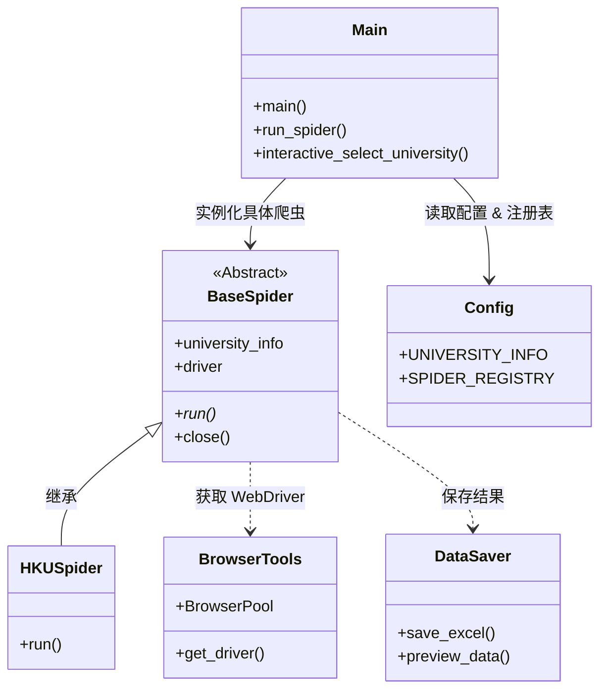

# MySpiderProject 项目框架与工作流程

这是一个基于 Python Selenium 的模块化、高并发爬虫项目，专门用于抓取大学研究生项目信息。

## 1. 📂 项目目录结构 (Directory Structure)

```text
MySpiderProject/
├── main.py                 # 🚀 程序入口：负责调度、参数解析和交互式选择
├── config.py               # ⚙️ 全局配置：大学信息、Excel 表头、浏览器参数
├── requirements.txt        # 📦 项目依赖
├── spiders/                # 🕷️ 爬虫核心逻辑
│   ├── base_spider.py      #    └── [基类] BaseSpider (定义通用接口)
│   ├── hongkong/           #    └── [地区] 香港高校实现
│   │   └── ...
│   ├── uk/                 #    └── [地区] 英国高校实现
│   └── usa/                #    └── [地区] 美国高校实现
├── utils/                  # 🛠️ 通用工具模块
│   ├── browser.py          #    └── 浏览器驱动管理 (Chrome Options, Performance)
│   ├── selenium_utils.py   #    └── 高级 Selenium 操作 (BrowserPool, Safe Click)
│   ├── data_saver.py       #    └── 数据存储 (Excel 导出, Preview)
│   └── progress.py         #    └── 进度显示 (Rich 终端美化, 多线程进度条)
└── output/                 # 📂 数据输出目录
```

## 2. 🏗️ 系统架构 (Architecture)

### 核心类图与调用关系



## 3. 🔄 工作流程 (Workflow)

整个爬虫的工作流如下：

### 1️⃣ 启动与调度 (Start & Dispatch)
*   **入口**: 用户运行 `main.py`。
*   **参数处理**: 支持命令行参数 (如 `python main.py hku --debug`) 或交互式菜单选择学校。
*   **工厂模式**: 根据字符串 Key (如 "hku") 从 `SPIDER_REGISTRY` 获取对应的爬虫类。

### 2️⃣ 初始化 (Initialization)
*   **实例化**: 创建具体爬虫实例 (如 `HKUSpider`)。
*   **浏览器准备**:
    *   **单例模式**: 默认情况下，`BaseSpider` 首次请求时懒加载浏览器。
    *   **BrowserPool**: 在大量并发时（如抓取海量详情页），通过 `utils.selenium_utils.BrowserPool` 管理多个浏览器实例池，复用 WebDriver 以提高性能。
    *   **性能优化**: `utils.browser.py` 配置了 `headless=new`、禁用图片/CSS/JS 等选项，最大化抓取速度。

### 3️⃣ 执行抓取 (Execution)
*   **List Phase**: 访问大学项目列表页 (`list_url`)，抓取基本信息。
*   **Detail Phase (Concurrent)**: 
    *   对于需要进入详情页的数据，使用 `ThreadPoolExecutor` 并发抓取。
    *   配合 `utils.progress.CrawlerProgress` 在终端显示实时进度条、成功/失败统计。
    *   智能处理：自动处理“新窗口打开”、“点击跳转”等复杂交互。

### 4️⃣ 数据处理与输出 (Output)
*   **标准化**: 数据统一转换为字典格式，字段由 `config.EXCEL_COLUMNS` 定义。
*   **预览**: 使用 Rich 库在终端打印漂亮的表格预览。
*   **持久化**: `utils.data_saver` 将结果保存为 Excel (`.xlsx`)，自动处理文件名时间戳。

## 4. ✨ 关键特性 (Key Features)

1.  **模块化设计**: 新增学校只需继承 `BaseSpider` 并实现 `run()`，无需修改框架代码。
2.  **高性能并发**: 内置 `BrowserPool` 和线程池，支持多窗口并行抓取。
3.  **鲁棒性**: 
    *   自动重试机制。
    *   智能等待元素 (`WebDriverWait`)。
    *   异常捕获与失败记录。
4.  **终端美化**: 使用 `rich` 库提供专业的 CLI 界面和进度反馈。

---

**🤖 给 ChatGPT 的提示词建议:**

> "我的项目是一个基于 Python Selenium 的模块化高并发爬虫框架。
>
> **项目结构**:
> *   `main.py`: 入口与调度中心。
> *   `spiders/`: 存放继承自 `BaseSpider` 的具体学校爬虫。
> *   `utils/`: 包含 `BrowserPool` (浏览器池)、`CrawlerProgress` (多线程进度管理) 和 `DataSaver`。
> *   `config.py`: 统一管理配置。
>
> **核心逻辑**:
> 爬虫启动后，会自动初始化优化过的 Chrome WebDriver (Headless 模式)。对于列表页，它按顺序解析；对于详情页，它使用线程池配合 BrowserPool 进行并发抓取，并将结果实时显示在 Rich 进度条上。最终结果会自动导出为 Excel。
>
> 请基于这个架构..."
